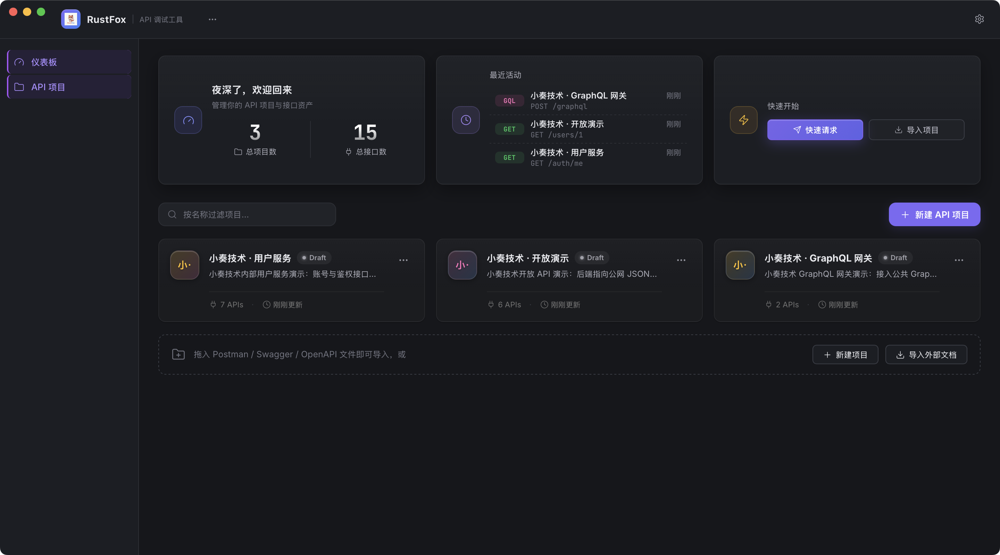
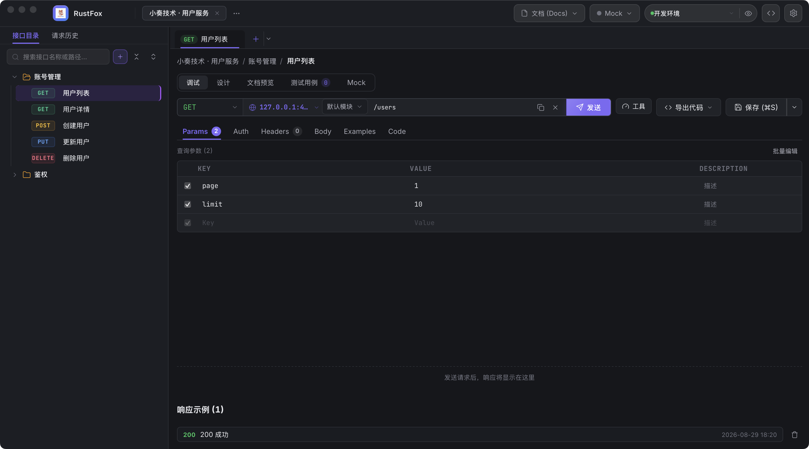

# RustFox Architecture

**Language / 语言**：[简体中文](../ARCHITECTURE.md) · English

This document reflects the **current codebase** (post Tauri 2 migration) and replaces the old
Dioxus architecture chapter in `docs/SPEC.md`. If the code and this document disagree, the code
wins — and please update this document.

## 1. Overview


(Editable source: [imags/architecture.svg](../imags/architecture.svg))

Three layers:

| Layer | Form | Location |
|---|---|---|
| Layer 1 · Frontend | Vue 3 + TypeScript (Vite + Tailwind 4 + Pinia) | `frontend/` |
| Layer 2 · Command layer | Tauri 2 plugin `fox` (`Builder::new("fox")`, exposes `plugin:fox|*` commands) | `crates/fox-tauri/` (standalone workspace) |
| Layer 3 · Domain layer | Pure library crates, no UI-framework dependency | the rest of `crates/` |

Frontend and backend communicate via **Tauri IPC** (`invoke('plugin:fox|command', args)`);
domain crates call each other through **path dependencies** (plain Rust), never through IPC.

## 2. Tech stack (actual dependency list)

| Module | Technology |
|---|---|
| Desktop shell | Tauri 2 (`tauri` crate + `@tauri-apps/api` v2) |
| Frontend | Vue 3.5 (`<script setup>` composition API) + TypeScript 5.6 |
| Build | Vite 6 + `@vitejs/plugin-vue` + Tailwind CSS 4 (`@tailwindcss/vite`) |
| State | Pinia 2.2 (single store: `stores/workspace.ts`) |
| Router | vue-router 4 (web history, single-window SPA) |
| Charts | chart.js + vue-chartjs (load-test results) |
| IPC wrapper | `composables/useFoxApi.ts` (type safety + error mapping) |
| Async runtime | Tokio (workspace-wide `tokio = "1"`) |
| Local database | SQLite + SQLx (`runtime-tokio-rustls` / `sqlite` / `migrate`) |
| HTTP client | reqwest 0.12 (rustls-tls / cookies / multipart / stream) |
| Mock server | axum 0.7 + tower / tower-http |
| OpenAPI | openapiv3 2.0 (import/export) |
| Crypto | aes-gcm (fox-secret, AES-256-GCM env vars, `master.key`) |
| Assertions/mock | jsonpath-rust, fake, rand (tests & mock template variables) |
| Logging | tracing + tracing-subscriber |
| File dialogs | rfd (import/export) |

> The old constraints "Dioxus Desktop" and "no TypeScript/Vue" are **obsolete** — see
> [`docs/TAURI_MIGRATION.md`](../TAURI_MIGRATION.md).

## 3. Workspace layout

```text
rustfox/
├── Cargo.toml                     # root workspace (11 pure library crates, no tauri)
├── crates/
│   ├── fox-core/                  # domain models, errors, variable engine ({{name}} resolution)
│   ├── fox-storage/               # SQLx migrations (migrations/), repositories, db init
│   ├── fox-http/                  # reqwest request build/send, cURL parsing, WS client
│   ├── fox-openapi/               # OpenAPI 3.x / Swagger 2.0 import & export
│   ├── fox-mock/                  # axum mock server (port probing from 4010)
│   ├── fox-test/                  # test runner (assertions, extraction, load testing)
│   ├── fox-backup/                # JSON backup / restore (ID remapping)
│   ├── fox-secret/                # AES-256-GCM (env var values, master.key)
│   ├── fox-codegen/               # multilingual client code generation
│   ├── fox-oauth/                 # OAuth2 four flows (browser auth / token endpoint)
│   └── fox-smoke/                 # smoke tests (app-launch skeleton, health checks)
├── crates/fox-tauri/              # standalone workspace: Tauri 2 plugin wrapper (see §4)
├── frontend/                      # Vue 3 frontend (see §5)
│   ├── src-tauri/                 # Tauri app shell (tauri.conf.json, capabilities, icons)
│   └── dist/                      # vite build output (frontendDist points to ../dist)
├── scripts/                       # packaging scripts (package-tauri.sh etc.)
└── docs/                          # this documentation
```

> `crates/fox-tauri` is excluded from the root workspace: the tauri dependency is heavy and would
> slow down main-repo builds; it references `fox-*` crates via path dependencies and resolves
> independently (`[workspace]` deliberately empty — see its `Cargo.toml` comment).
> `links = "fox"` fixes the permission namespace prefix and must match `Builder::new("fox")`.

## 4. fox-tauri command layer

- Entry point: `plugin::init()` in `crates/fox-tauri/src/lib.rs`.
- `setup` flow: `fox_storage::db::init_db(database_path())` (create dirs + run migrations) →
  `app.manage(AppState::new(db))` holds the pool and active context.
  In debug builds the dev database is reset and re-seeded with test fixtures on every launch
  (`fox_storage::db::reset_dev_database` + `seed::seed_dev_data`); release builds skip both.
- `AppState` (`state.rs`): `SqlitePool` + `RwLock` active project/environment + Mock state `Mutex`.
- Commands: 60+ registered via `generate_handler!`, split by module
  (`commands/{project,folder,endpoint,environment,request,history,example,mock,mock_rule,load_test,oauth,codegen,import_export,backup,curl,settings,agent,test_case,...}.rs`).
- Error convention: every command returns `Result<T, CommandError>`; `CommandError` serializes to
  `{ code, message }` (`VALIDATION` / `NOT_FOUND` / `DECRYPT` / `IO` / …);
  the frontend `useFoxApi.call()` converts them into `Error`s carrying `code`.
- Event push: e.g. load-test progress via `AppHandle.emit("fox:load-progress", …)`.
- Permissions: the `fox:default` permission set is declared in `frontend/src-tauri/capabilities/`
  (`permissions/` is generated by the `tauri-plugin` build dependency; every registered command
  must also be listed in `build.rs` and `permissions/default.toml` — guarded by a contract test).

## 5. Frontend structure

```text
frontend/
├── src/
│   ├── main.ts                     # createApp + Pinia + router
│   ├── App.vue                     # global error boundary / syntax themes / theme
│   ├── router/index.ts             # /projects, /workspace, /graphql
│   ├── views/
│   │   ├── ProjectList.vue         # dashboard: welcome/stats, project cards, drag-drop import
│   │   ├── WorkspaceView.vue       # workspace: top bar + sidebar + tabs + editor
│   │   └── GraphQLView.vue         # GraphQL debugging view
│   ├── stores/workspace.ts         # the single Pinia store (projects/envs/tabs/tree/history)
│   ├── composables/
│   │   ├── useFoxApi.ts            # unified IPC wrapper (auto plugin:fox prefix)
│   │   ├── useToast.ts / useProgress.ts / useTheme.ts
│   ├── components/                 # EndpointEditor / EndpointTree / ResponsePanel /
│   │   │                           # TabBar / EnvironmentBar / ToolsDrawer / SettingsDialog /
│   │   │                           # Params/Headers/Body/Auth/Tests/Docs panels / …
│   │   └── ui/                     # base widget library (buttons/inputs/selects/menus…)
│   └── types/foxApi.d.ts           # command signatures mirroring the Rust models (hand-maintained)
└── src-tauri/
    ├── tauri.conf.json             # 1360×900 main window (overlay title bar), devUrl:5173
    ├── capabilities/default.json   # core:default + fox:default
    └── icons/
```

UI conventions: `src/style.css` defines the design tokens (`--bg-* / --text-* / --accent: #7c69f5`);
components only reference tokens. Dark / light / follow-system themes are supported.

## 6. UI overview

### Dashboard (/projects)



- Top bar: RustFox brand + project tabs + settings.
- Left nav: Dashboard (current) / API Projects.
- Main area: welcome & stat cards (projects / endpoints / recent activity / quick start),
  project filter and creation, project card grid (enter → `/workspace`), drag-and-drop import zone.

### Workspace (/workspace)



- Top bar: brand / project tabs (with rename & delete menu) / environment pill selector / Mock status /
  docs & Mock dropdowns / GraphQL workbench / settings.
- Sidebar: Collections / History tabs + search + toolbar (`+ New` dropdown: request / folder /
  cURL / document import, collapse-all & expand-all) + tree (folders & endpoints, drag-to-move,
  inline rename, context menus).
- Tab bar: one tab per endpoint; unsaved drafts flagged with `●`.
- Request editor: method select + URL (with `{{variables}}`) + save / send / export code;
  Params / Headers / Body / Auth / Tests / Docs / Scripts tabs.
- Response pane: status / duration / size / headers / pretty JSON tree / raw / download.

## 7. Key data flows

### 7.1 Sending a request

```text
Frontend EndpointEditor (Send)
  → useFoxApi.executeRequest({ spec, environment_id, project_id })
  → IPC invoke('plugin:fox|execute_request')
  → fox-tauri commands::request::execute_request
  → fox-core variable engine resolves {{name}} (environment > project > global)
  → fox-http builds the reqwest request (Auth/Body/Headers)
  → target server
  ← response → fox-http parses (status/headers/body/duration/size)
  ← also written to fox-storage request_histories
  ← ExecuteResponse returned → frontend ResponsePanel renders
```

Requests can be cancelled anytime (`cancel_request`, abort token); downloads stream to disk.

### 7.2 Mock server

```text
Settings "Start Mock"
  → mock_start → fox-mock::start (port probing from 4010)
  → axum routing:
     mock rules match first (method + path + headers + query + body template)
     fallback: the endpoint's saved "response examples"
  template vars: {{params.*}} {{query.*}} {{headers.*}} {{mock.uuid|email|name|word|timestamp|int}}
```

### 7.3 OAuth2

```text
Auth panel "Authorize"
  → oauth_authorize: starts a local callback port, opens the authorize URL in the system browser
  → callback captures the code → oauth_access_token: exchanges & stores the token
  → send attaches the Authorization header / cookies automatically
```

## 8. Data & security

| Item | Description |
|---|---|
| Database | `{data_dir}/RustFox/rustfox.db` (single SQLite file; SQLx migrations in `fox-storage/migrations/`) |
| Encryption | Environment variable values are AES-256-GCM encrypted with the `master.key` file; the `DECRYPT` error code means key mismatch |
| Backup | fox-backup exports JSON (with plaintext variables); restore remaps all IDs into a brand-new project |
| Save semantics | Every save path with an id is an **upsert** (`INSERT … ON CONFLICT(id) DO UPDATE`) — renames/edits never hit primary-key conflicts |

## 9. Documentation index

| Document | Content |
|---|---|
| [README.md](../../README.md) | Product intro, downloads, building |
| [USER_GUIDE.md](USER_GUIDE.md) | End-user manual (English) |
| [AGENT.md](AGENT.md) | AI Agent integration (English) |
| [SPEC.md](../SPEC.md) | Detailed spec (Chinese: features/models/database/commands) |
| [TAURI_MIGRATION.md](../TAURI_MIGRATION.md) | Dioxus → Tauri migration record (Chinese) |
| [DEPLOY.md](../DEPLOY.md) | Packaging & deployment (Chinese) |
| [SMOKE_TEST.md](../SMOKE_TEST.md) | Manual acceptance checklist (Chinese) |
